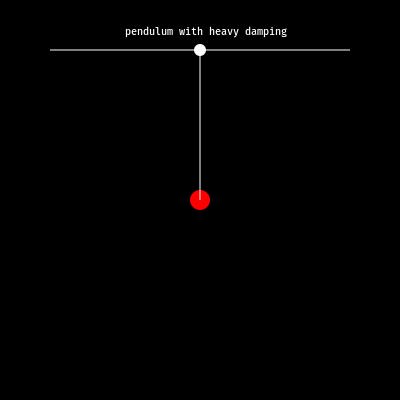

# graphic-dev

This repository is a collection of graphics and animations made  by the members of the [Humans of Julia Discord Community](https://humansofjulia.org/) using different packages in the [Julia language](https://julialang.org/).

Main libraries used are:
* [`Luxor.jl`](https://github.com/JuliaGraphics/Luxor.jl): Luxor.jl is a super cool package for making simple 2D vector graphics.

* [`Javis.jl`](https://github.com/Wikunia/Javis.jl): Javis is an amazing library that allows to create simple 2D animations with ease!

More information about additional related libraries can be found in the documentation of those libraries.

P.S.: They both have very amazing docs, very easy to read and understand!

The folders in the repo are:
* `Javis`: Home to animations made with the awesome library Javis.

# Gallary

| Title                                                                                      | Animation                                              |
| ------------------------------------------------------------------------------------------ | ------------------------------------------------------ |
| [Cosmic Dance of Earth and Venus](Javis/cosmic-dance/cosmic-dance.jl)                      |                |
| [Two Body animation](Javis/n-body/two_body.jl)                                             |                          |
| [Three Body animation](Javis/n-body/three_body.jl)                                         |                        |
| [Parabola made with only straight lines](Javis/parabola_with_lines/parabola_with_lines.jl) |  |
| [Pendulum with no damping](Javis/pendulum/pendulum_no_damping.jl)                          |             |
| [Pendulum with light damping](Javis/pendulum/pendulum_light_damping.jl)                    |          |
| [Pendulum with heavy damping](Javis/pendulum/pendulum_heavy_damping.jl)                    |          |
